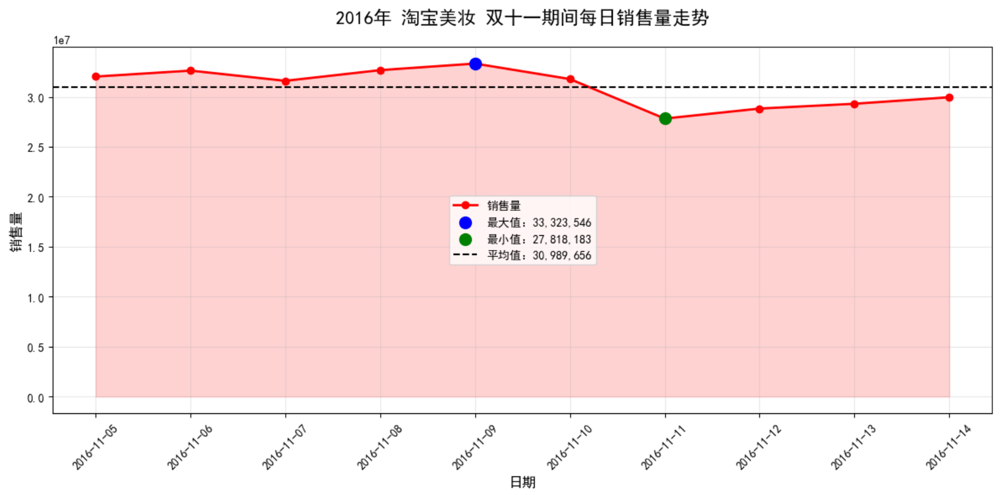
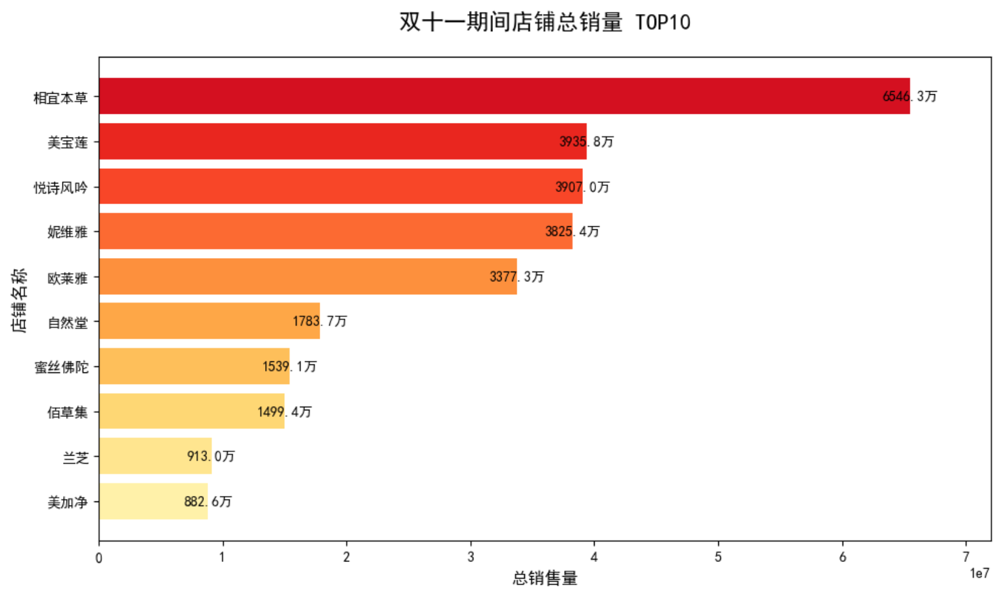
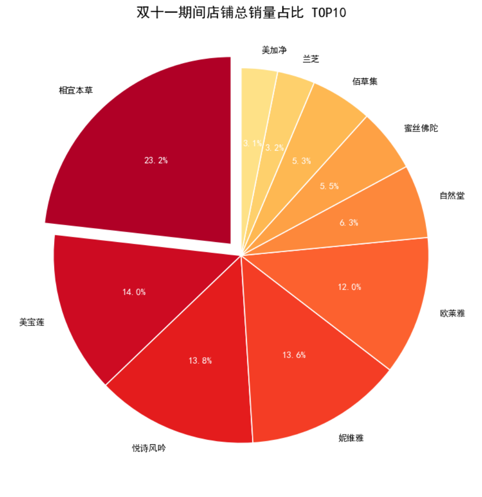
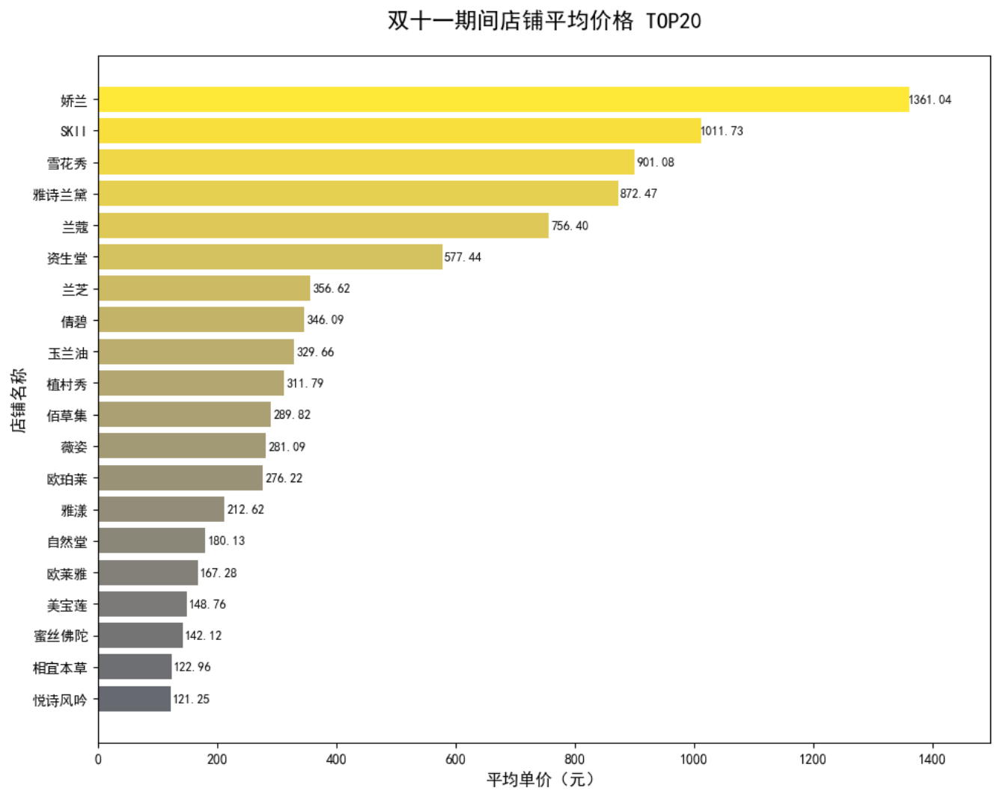

## 双十一淘宝美妆销售数据分析项目  
本项目为电商美妆品类全流程数据分析项目，独立完成从数据结构化存储、SQL 数据清洗治理、Python 探索性分析到可视化呈现的完整数据分析工作流，最终输出可落地的电商运营业务洞察，可作为数据分析岗位求职的核心项目案例。

### 一、项目概述  
**项目背景**  
双十一作为电商行业核心大促节点，美妆品类是消费主力赛道。本项目基于 2016 年双十一淘宝美妆全周期销售数据，通过标准化的数据治理与多维度分析，挖掘大促周期内的销售规律、头部品牌竞争格局、价格与销量的关联特征，为电商美妆品类的大促运营策略提供数据支撑。

**项目目标**  
- 完成原始数据的结构化存储与全流程清洗，构建规范、可分析的数据集。
- 从时间、品牌、价格三大核心维度，拆解双十一美妆销售的核心特征。
- 通过可视化直观呈现数据规律，输出业务导向的分析结论与运营建议。

**核心技术栈**  
- 数据库与 SQL：MySQL 8.0、DataGrip 2025、窗口函数、聚合函数、数据清洗与特征工程。
- Python 数据分析：Pandas、SQLAlchemy
- 数据可视化：Matplotlib（静态可视化）、Pyecharts（交互式动态可视化）。

### 二、数据集说明
**数据集基础信息**  
本项目使用数据集为双十一淘宝美妆数据.csv，覆盖 2016 年 11 月 5 日 - 11 月 14 日（双十一预热期 - 爆发期 - 返场期）淘宝美妆品牌店铺的商品销售数据，原始数据共 27598 条 记录，7 个核心字段。
- 分析维度：时间维度（日粒度）、品牌店铺维度。
- 核心指标：销售量、销售额、平均单价、评论数。

### 三、SQL 数据处理与清洗
本环节基于 MySQL 完成原始数据的结构化存储与全流程治理，解决原始数据的重复、缺失、格式不规范等问题，为后续分析构建高质量数据集。

**1. 库表设计与数据导入**  
- 核心操作：创建专属分析库double11_beauty_analysis，基于数据集字段设计结构化表beauty_sales，合理设置字段类型、长度与注释，使用LOAD DATA LOCAL INFILE实现 CSV 数据的批量自动化导入。
- 实现价值：完成非结构化 CSV 数据到结构化数据库表的转换，保证金额类数据的精度，为后续 SQL 操作奠定基础。

**2. 重复数据治理**
- 核心操作：通过GROUP BY + HAVING统计全字段重复数据，共识别 86 条 完全重复记录；使用ROW_NUMBER()窗口函数对全字段分区去重，仅保留每组唯一有效数据，去重后有效数据量 27512 条。
- 实现价值：消除重复数据对聚合统计结果的干扰，保证数据的唯一性与准确性。

**3. 缺失值处理**
- 核心操作：通过COUNT聚合函数统计各字段空值，识别sale_count、comment_count字段共 2350 条 缺失值，使用COALESCE函数将缺失值统一填充为 0。
- 实现价值：解决缺失值导致的聚合计算偏差问题，保证后续销量、销售额统计的完整性。

**4. 日期格式标准化**
- 核心操作：通过STR_TO_DATE + DATE_FORMAT函数，将原始YYYY/MM/DD格式的日期字符串，统一转换为YYYY-MM-DD标准日期格式。
- 实现价值：完成日期字段的格式标准化，支持后续按日粒度的分组聚合与时间趋势分析。

**5. 特征工程**
- 核心操作：新增sale_amount销售额字段，通过price * sale_count计算单商品销售额。
- 实现价值：丰富核心分析指标，为品牌销售排行、市场规模测算提供核心数据支撑。

### 四、Python 数据分析与可视化
通过SQLAlchemy建立 Python 与 MySQL 的连接，使用Pandas读取清洗后的全量数据，完成多维度探索性数据分析（EDA），分别通过 Matplotlib 实现静态可视化、Pyecharts 实现交互式动态可视化，直观呈现数据规律。

**4.1 时间维度：双十一全周期销售趋势分析**    
分析逻辑：按日期分组聚合，统计每日全平台总销售量，绘制趋势折线图，观察大促周期内的销量波动规律，定位销量峰值与波动特征。

核心洞察：
- 双十一周期内销量整体维持高位，销量峰值出现在预热期的 11 月 9 日，而双十一当天的销量反而低于周期均值。
这说明预热期提前撬动了用户消费，而双十一当天的运营、优惠、流量策略没有达到预期的爆发效果。  
为后续大促的节奏规划提供了数据支撑，明确了用户的消费高峰会提前到来。  
后续大促可以调整预热节奏，在峰值前加大投放力度，同时优化双十一当天的运营动作，
比如增加限时福利、爆款补库存，拉动当天的销量回升；

**4.2 品牌维度：头部店铺销量竞争格局分析**  
分析逻辑：按店铺名称分组聚合，统计全周期品牌总销售量，筛选销量 TOP10 品牌，分别通过横向柱状图呈现销量绝对值、饼图呈现市场占比，拆解头部品牌的竞争格局。
可视化呈现 1：品牌销量绝对值排行

可视化呈现 2：品牌销量市场占比

核心洞察：
- 赛道出现断层头部：TOP1 相宜本草以 6546.3 万的总销量遥遥领先，是第二名美宝莲的 1.66 倍，在大促中形成了绝对优势；
- 第二梯队竞争白热化：TOP2-TOP5 的美宝莲、悦诗风吟、妮维雅、欧莱雅销量差距极小，首尾仅相差 558.5 万，其中美宝莲和悦诗风吟仅差 28.8 万，头部腰部的竞争非常激烈；
- 梯队分层明显：TOP6-TOP10 的品牌销量均在 2000 万以下，和前五名形成了清晰的销量断层。

**4.3 价格维度：品牌单价分层与价格带分析**  
分析逻辑：按店铺名称分组聚合，计算各品牌商品的平均单价，筛选平均单价 TOP20 品牌，通过横向柱状图呈现高端品牌的价格带分布，拆解美妆品类的价格分层特征。

业务价值：  
- 大促策略复盘与优化价值：可以反向验证头部品牌的大促效果，比如相宜本草的断层领先，说明它的预热节奏、流量投放、爆款打造策略是成功的，不管是品牌方还是平台，都可以拆解其可复用的玩法，给后续大促的策略设计提供参考。  
- 平台商家运营价值：对于淘宝平台来说，这份 TOP10 榜单明确了美妆赛道的核心 KA 商家，平台的商务、运营团队可以针对性地给头部商家做资源扶持、库存保障，同时针对腰部品牌制定孵化策略，优化整个赛道的商家结构。

核心洞察：
- 赛道超高端头部断层明显：TOP1 娇兰以 1361.04 元的均价断层领先，是第二名 SK-II 的 1.35 倍，牢牢占据超高端定价天花板；
- 价格带梯队分层清晰：TOP4 品牌均价均在 800 元以上，属于超高端梯队；兰蔻、资生堂处于 500-800 元的高端区间；而此前销量 TOP 的相宜本草、悦诗风吟，均价仅 120 元左右，和超高端品牌形成 10 倍以上的价差；
- 销量与定价呈现两极分化：此前销量榜单的头部大众品牌，完全没有进入均价 TOP20，说明双十一美妆赛道呈现出 “大众品牌走量、高端品牌走价” 的明显分化，高端消费需求在大促期间依然旺盛。

### 五、项目核心结论与业务建议
**1. 大促节奏运营建议**  
双十一销量核心爆发点集中在 11 月 9 日当天。品牌可在双十一当天加大内容种草与引流蓄水，大促当天推出核心爆款冲刺销量，大促后通过返场活动承接长尾消费需求，最大化全周期转化。

**2. 品牌竞争策略建议**  
大众平价美妆品牌在大促中具备绝对的销量优势，男士护肤品类是爆款高发赛道。中腰部品牌可针对男性消费群体推出高性价比的大单品，抢占下沉市场；高端品牌可主打限定礼盒套装，通过提升客单价对冲销量规模的不足。
 
**3. 价格策略建议**   
美妆品类价格与销量呈显著负相关，品牌需根据自身定位制定差异化大促策略：平价品牌主打「爆款低价冲量」，通过引流款抢占销量榜单；高端品牌主打「高端价值感」，避免盲目降价损伤品牌调性，通过满赠、套装等方式提升客单价。

### 六、文件说明

双十一淘宝美妆数据.csv：数据文件
双十一淘宝美妆数据.sql：数据清洗sql
双十一淘宝美妆数据分析.ipynb：数据可视化python

